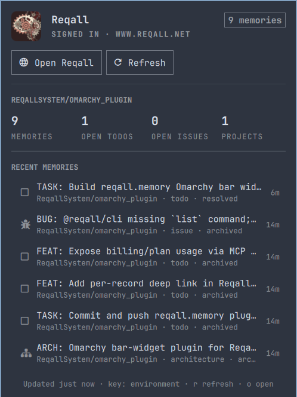

# Reqall for Omarchy

A native [Omarchy](https://omarchy.org) bar widget for [Reqall](https://www.reqall.net):
one icon in the status bar, one panel with your recent memories, open work,
and account status. It is a shell plugin, not a separate app: it runs inside
`omarchy-shell` and uses the same panel kit as the built-in widgets.



## Requirements

- Omarchy 4.0 or newer (the Quickshell-based shell with `omarchy plugin`).
- A Reqall account and an API key. If you already use the Reqall plugin for
  Claude Code or Codex, the key in `~/.config/reqall/env` is reused as is.

## Install

```bash
omarchy plugin add https://github.com/ReqallSystem/omarchy_plugin.git --enable
```

Pick a bar section when prompted, or place it later:

```bash
omarchy bar move reqall.memory --section right
```

Click the new brain icon. If it says **Not signed in**, use the panel's
**Sign in / Sign up** and **Get API key** buttons, then store the key (see below).

## Install with your AI agent

Paste this into Claude Code, Codex, or any agent that can run shell commands on
your Omarchy machine:

```text
Install the Reqall widget for the Omarchy bar and get it signed in.

1. Run: omarchy plugin add https://github.com/ReqallSystem/omarchy_plugin.git --enable --yes
   Then confirm with: omarchy plugin list | grep reqall.memory
   If the plugin is already installed, run `omarchy plugin update reqall.memory --yes` instead.
2. Check for an existing Reqall API key, in this order: the REQALL_API_KEY
   environment variable, ~/.config/reqall/env, ~/.config/reqall/config.json.
   If one exists, skip to step 4.
3. Otherwise ask me for a key. I can create one at
   https://www.reqall.net/dashboard#keys (sign up or sign in first at
   https://www.reqall.net/auth/login). Never guess or fabricate a key.
   Save what I give you with:
     mkdir -p ~/.config/reqall
     printf 'export REQALL_API_KEY=%s\n' "<key>" >> ~/.config/reqall/env
     chmod 600 ~/.config/reqall/env
   Do not print the key back to me or write it anywhere else.
4. Run: omarchy-shell reqall.memory refresh
   then: omarchy-shell reqall.memory open
   and tell me whether the panel shows "Signed in" or an error message.
5. Optional: I can change the icon with
   omarchy bar set reqall.memory barIcon brain|head-cog|emoji
   and move it with omarchy bar move reqall.memory --section left|center|right.
```

The same text lives in [`doc/agent-prompt.md`](doc/agent-prompt.md).

## Sign in

The widget needs a Reqall API key. It looks, in order, at:

1. the widget's own `apiKey` setting (`omarchy bar set reqall.memory apiKey rq_...`)
2. `REQALL_API_KEY` in the shell's environment
3. `~/.config/reqall/env` (the file the Reqall Claude Code plugin sources)
4. `~/.config/reqall/config.json`, written by `reqall login`

With no working key the panel offers **Sign in / Sign up** and **Get API key**,
which open the Reqall site in your browser. Create a key on the dashboard, then
either paste it into the widget's settings or add it to `~/.config/reqall/env`:

```bash
mkdir -p ~/.config/reqall
echo 'export REQALL_API_KEY=rq_your_key_here' >> ~/.config/reqall/env
chmod 600 ~/.config/reqall/env
```

The panel refreshes on its own once a key is available. To update, run
`omarchy plugin update reqall.memory`; to remove, `omarchy plugin remove reqall.memory`.

## Panel

- **Hero**: the Reqall mark, sign-in state, server, and total memory count.
- **Actions**: open the dashboard, refresh, or sign in.
- **Remember**: add a record without leaving the bar (see below).
- **Usage**: memories, open todos, open issues, and projects.
- **Recent memories**: the latest records with kind, project, status, and age.

Keyboard: `j`/`k` move, `h`/`l` switch buttons, `Enter` activates, `r`
refreshes, `o` opens the dashboard, `a` or `/` jumps to the Remember form,
`Esc` closes, `Tab` moves to the next panel. Middle-click the bar icon to
refresh, right-click to open the dashboard.

### Remember

When you are signed in, the panel opens with the cursor in the Remember
form's project search, so you can click the icon and start typing:

1. **Project**: type any part of a project name; matching is fuzzy, so
   `rqomp` finds `ReqallSystem/omarchy_plugin`. Before you type, the list
   shows the `project` filter (tagged *current*), the projects you last
   remembered into (*last used*), then the most recently active. `↑`/`↓`
   pick, `Enter` or `Tab` confirms. The filter project, or else the last
   used one, is preselected.
2. **Title** (required) and **Body** (optional, multi-line).
3. **Kind**: `auto` lets Reqall classify the record; or pick todo, issue,
   spec, arch, info, test, or work (`h`/`l` with the row focused).
4. **Remember** (`Ctrl+Enter` from any field). The title and body clear, the
   project stays for the next one, and the record shows up under Recent
   memories.

In the form, `Tab`/`Shift+Tab` move between fields and `Esc` hands the keys
back to the panel (a second `Esc` closes it). The project list loads when the
panel opens and is cached for ten minutes; the last-used list lives in
`~/.local/state/reqall-widget/used-projects`.

## Settings

Set with `omarchy bar set reqall.memory <key> <value>` or in the bar settings panel.

| Key                  | Default | Meaning                                              |
|----------------------|---------|------------------------------------------------------|
| `barIcon`            | `brain` | `brain` or `head-cog` (monochrome glyphs), or `emoji` for 🧠 |
| `apiKey`             | empty   | Reqall API key; overrides every other source         |
| `serverUrl`          | empty   | Reqall server; defaults to `REQALL_URL` or reqall.net |
| `project`            | empty   | Exact Reqall project filter, e.g. `acme/notes` or `.machine/host/user`; empty means account-wide. No directory-derived name. |
| `recentCount`        | 6       | Recent memories shown (3 to 15)                      |
| `refreshIntervalSec` | 300     | Background refresh interval                          |

IPC: `omarchy-shell reqall.memory toggle|open|close|refresh`.

## How it works

- `Panel.qml` is the bar-widget entry point: the icon, the popup, and keyboard navigation.
- `Main.qml` runs `bin/reqall-widget-fetch` on a timer and exposes the parsed
  result; it also runs the Remember form's two scripts.
- `bin/reqall-widget-fetch` calls the Reqall MCP endpoint (`POST /mcp`,
  `list_records` and `list_projects`) with `curl` and `jq` and prints one JSON document.
- `bin/reqall-widget-projects` lists every project for the picker, with a
  recent-activity time for each.
- `bin/reqall-widget-remember` creates the record with `upsert_record`
  (tagged `session_id: omarchy:reqall.memory`). The form's text reaches it
  through environment variables, never through a shell command line.
- `bin/reqall-widget-lib.sh` holds what the three share: credential lookup and the MCP call.
- `Model.js` holds pure helpers: relative times, kind glyphs, count
  formatting, and the picker's fuzzy matching and ordering.

Only `curl`, `jq`, and `bash` are required, all of which Omarchy ships.

## Development

```bash
# Run the fetch scripts directly
./bin/reqall-widget-fetch | jq .
./bin/reqall-widget-projects | jq '.projects | length'

# Unit tests for Model.js (fuzzy matching, ordering, parsing)
node --test

# Validate the manifest and entry points
omarchy plugin validate .

# Install a working copy; edits under ~/.config/omarchy/plugins hot-reload
rsync -a --delete --exclude .git ./ ~/.config/omarchy/plugins/reqall.memory/
omarchy-shell shell rescanPlugins
omarchy plugin enable reqall.memory --section right

# The shell caches compiled QML; if an edit to Panel.qml does not show up,
# restart it
omarchy restart shell

# Shell log (instance id from `qs list --all`)
qs log -i <instance> -t 200 | grep reqall
```
